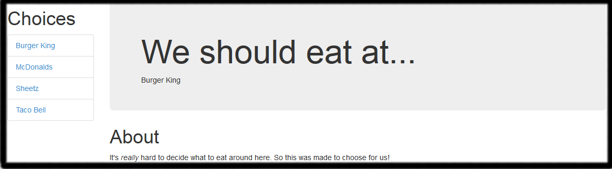

% HTML Primer
% Kevin Raoofi
% Frostburg Computer Club 2014-10-14

# What is this all about?
There are 3 main technologies in the web stack

* HTML - Hyper Text Markup Language
	* Defines document structure
* CSS - Cascading Style Sheets
	* Defines document appearance
* JS - JavaScript
	* Interactivity, etc.

----

# What am I going to get out of this?
This is a primer on HTML, CSS, and JavaScript development. After this you'll
hopefully be able to:

1. Have a grasp at what HTML+CSS+JavaScript is
2. Be able to use Bootstrap's premade components to style your pages
3. Inspect elements via a browser to tweak CSS
4. Have enough confidence to pursue self study resources

# What am I not getting out of this?

* Understanding the variety of HTML tags. You'll be able to find plenty of examples of when to use certain ones online.
* Know any real form of JavaScript.
* Mobile friendly websites (AKA responsive web design)

----

# Basics

```html
<!DOCTYPE html>
<html>
	<head>
		<title></title>
		<!-- Resources and Stylesheets -->
	</head>
	<body>
	</body>
</html>
```

----

# Basic Outline
Before you start, think about what you want the finished product to look.
Now, think about what each of the sections of documents are.

Don't worry too much about how to make the document look the way you envisioned
it, yet. HTML is for defining structure!



----

# Simple HTML
[Results](01.html)

```html
<!DOCTYPE html>
<html>
	<head>
		<title>Where should we eat today, Russell?</title>
	</head>
	<body>
		<div class='container'>
			<div id='choices'>
				<h1>Choices</h1>
				<ul>
					<li><a href='http://bk.com'>Burger King</a></li>
					<li><a href='http://mcdonalds.com'>McDonalds</a></li>
					<li><a href='http://sheetz.com'>Sheetz</a></li>
					<li><a href='http://tacobell.com'>Taco Bell</a></li>
				</ul>
			</div>
			<div>
				<h1>We should eat at...</h1>
				<div id='result'>
					Go to McDonalds every day!
				</div>
			</div>
			<div id='about'>
				<h1>About</h1>
				<p>
				It's <em>really</em> hard to decide what to eat around here.
				So this was made to choose for us!
				</p>
			</div>
		</div>
	</body>
</html>
```

----

# Let's Add Some CSS
[Results](02.html)

```html
<!DOCTYPE html>
<html>
	<head>
		<title>Where should we eat today, Russell?</title>
		<style>
			.container {
				background: rgb(255,0,255);
				color: rgb(10, 10, 175);
			}
		</style>
	</head>
	<body>
		<div class='container'>
			<div id='choices'>
				<h1>Choices</h1>
				<ul>
					<li><a href='http://bk.com'>Burger King</a></li>
					<li><a href='http://mcdonalds.com'>McDonalds</a></li>
					<li><a href='http://sheetz.com'>Sheetz</a></li>
					<li><a href='http://tacobell.com'>Taco Bell</a></li>
				</ul>
			</div>
			<div>
				<h1>We should eat at...</h1>
				<div id='result'>
					Go to McDonalds every day!
				</div>
			</div>
			<div id='about'>
				<h1>About</h1>
				<p>
				It's <em>really</em> hard to decide what to eat around here.
				So this was made to choose for us!
				</p>
			</div>
		</div>
	</body>
</html>
```

----

# Let's Add Some JavaScript!
[Result](03.html)

```html
<!DOCTYPE html>
<html>
	<head>
		<title>Where should we eat today, Russell?</title>
		<style>
			.container {
				background: rgb(255,0,255);
				color: rgb(10, 10, 175);
			}
		</style>
	</head>
	<body>
		<div class='container'>
			<div id='choices'>
				<h1>Choices</h1>
				<ul>
					<li><a href='http://bk.com'>Burger King</a></li>
					<li><a href='http://mcdonalds.com'>McDonalds</a></li>
					<li><a href='http://sheetz.com'>Sheetz</a></li>
					<li><a href='http://tacobell.com'>Taco Bell</a></li>
				</ul>
			</div>
			<div>
				<h1>We should eat at...</h1>
				<div id='result'>
				</div>
			</div>
			<div id='about'>
				<h1>About</h1>
				<p>
				It's <em>really</em> hard to decide what to eat around here.
				So this was made to choose for us!
				</p>
			</div>
		</div>
		<script type='text/javascript'>
			var food = function() {
				var placesToEat = ["McDonalds", "Sheetz", "Burger King", "Taco Bell"];
				return placesToEat[Math.floor((Math.random()*4))];
			}
			document.getElementById("result").innerHTML = food();
		</script>
	</body>
</html>
```

----

# Externalizing CSS
[CSS](style.css)

```css
.container {
	background: rgb(255,0,255);
	color: rgb(10, 10, 175);
```

----

# Externalizing JavaScript
[JavaScript](script.js)

```javascript
var pickPlace = function() {
	var food = function() {
		var placesToEat = ["McDonalds", "Sheetz", "Burger King", "Taco Bell"];
		return placesToEat[Math.floor((Math.random()*4))];
	}
	document.getElementById("result").innerHTML = food();
};
```

----

# Externalizing CSS and JavaScript - HTML
[Results](04.html)

```html
<!DOCTYPE html>
<html>
	<head>
		<title>Where should we eat today, Russell?</title>
		<link rel='stylesheet' type='text/css' href='style.css'/>
		<script type='text/javascript' src='script.js'></script>
	</head>
	<body>
		<div class='container'>
			<div id='choices'>
				<h1>Choices</h1>
				<ul>
					<li><a href='http://bk.com'>Burger King</a></li>
					<li><a href='http://mcdonalds.com'>McDonalds</a></li>
					<li><a href='http://sheetz.com'>Sheetz</a></li>
					<li><a href='http://tacobell.com'>Taco Bell</a></li>
				</ul>
			</div>
			<div>
				<h1>We should eat at...</h1>
				<div id='result'>
				</div>
			</div>
			<div id='about'>
				<h1>About</h1>
				<p>
				It's <em>really</em> hard to decide what to eat around here.
				So this was made to choose for us!
				</p>
			</div>
		</div>
		<script type='text/javascript'>
			pickPlace();
		</script>
	</body>
</html>
```

----

# Let's Use External Libraries
JQuery is one of the most popular JavaScript libraries out there.

We can define our script block in the head if we register our actions to be
taken after the document is ready.

[Results](05.html)

```html
<!DOCTYPE html>
<html>
	<head>
		<title>Where should we eat today, Russell?</title>
		<link rel='stylesheet' type='text/css' href='style.css'/>
		<script src="//ajax.googleapis.com/ajax/libs/jquery/2.1.1/jquery.min.js"></script>
		<script type='text/javascript' src='script.js'></script>
		<script type='text/javascript'>
			$('document').ready(pickPlace);
		</script>
	</head>
	<body>
		<div class='container'>
			<div id='choices'>
				<h1>Choices</h1>
				<ul>
					<li><a href='http://bk.com'>Burger King</a></li>
					<li><a href='http://mcdonalds.com'>McDonalds</a></li>
					<li><a href='http://sheetz.com'>Sheetz</a></li>
					<li><a href='http://tacobell.com'>Taco Bell</a></li>
				</ul>
			</div>
			<div>
				<h1>We should eat at...</h1>
				<div id='result'/>
				</div>
				<div id='about'>
					<h1>About</h1>
					<p>
					It's <em>really</em> hard to decide what to eat around here.
					So this was made to choose for us!
					</p>
				</div>
			</div>
	</body>
</html>
```

----

# Let's Add Bootstrap
[Result](06.html)

```html
<!DOCTYPE html>
<html>
	<head>
		<title>Where should we eat today, Russell?</title>
		<link rel='stylesheet' type='text/css' href='//maxcdn.bootstrapcdn.com/bootstrap/3.2.0/css/bootstrap.min.css'/>
		<link rel='stylesheet' type='text/css' href='style.css'/>
		<script src='//ajax.googleapis.com/ajax/libs/jquery/2.1.1/jquery.min.js'></script>
		<script src='//maxcdn.bootstrapcdn.com/bootstrap/3.2.0/js/bootstrap.min.js'></script>
		<script type='text/javascript' src='script.js'></script>
		<script type='text/javascript'>
			$('document').ready(pickPlace);
		</script>
	</head>
	<body>
		<div class='container'>
			<div id='choices'>
				<h1>Choices</h1>
				<ul>
					<li><a href='http://bk.com'>Burger King</a></li>
					<li><a href='http://mcdonalds.com'>McDonalds</a></li>
					<li><a href='http://sheetz.com'>Sheetz</a></li>
					<li><a href='http://tacobell.com'>Taco Bell</a></li>
				</ul>
			</div>
			<div>
				<h1>We should eat at...</h1>
				<div id='result'/>
				</div>
				<div id='about'>
					<h1>About</h1>
					<p>
					It's <em>really</em> hard to decide what to eat around here.
					So this was made to choose for us!
					</p>
				</div>
			</div>
	</body>
</html>
```

----

# Let's Use Some Bootstrap Classes!
[Result](07.html)

```html
<!DOCTYPE html>
<html>
	<head>
		<title>Where should we eat today, Russell?</title>
		<link rel='stylesheet' type='text/css' href='//maxcdn.bootstrapcdn.com/bootstrap/3.2.0/css/bootstrap.min.css'>
		<link rel='stylesheet' type='text/css' href='style.css'>
		<script src='//ajax.googleapis.com/ajax/libs/jquery/2.1.1/jquery.min.js'></script>
		<script src='//maxcdn.bootstrapcdn.com/bootstrap/3.2.0/js/bootstrap.min.js'></script>
		<script type='text/javascript' src='script.js'></script>
		<script type='text/javascript'>
			$('document').ready(pickPlace);
		</script>
	</head>
	<body>
		<div class='container'>
			<div class='row'>
				<div id='choices' class='col-md-2'>
					<h1>Choices</h1>
					<ul class='list-group'>
						<li class='list-group-item'><a href='http://bk.com'>Burger King</a></li>
						<li class='list-group-item'><a href='http://mcdonalds.com'>McDonalds</a></li>
						<li class='list-group-item'><a href='http://sheetz.com'>Sheetz</a></li>
						<li class='list-group-item'><a href='http://tacobell.com'>Taco Bell</a></li>
					</ul>
				</div>
				<div class='col-md-10'>
					<div class='jumbotron'>
						<h1>We should eat at...</h1>
						<div id='result'>
						</div>
					</div>
					<div id='about'>
						<h1>About</h1>
						<p>
						It's <em>really</em> hard to decide what to eat around here.
						So this was made to choose for us!
						</p>
					</div>
				</div>
			</div>
		</div>
	</body>
</html>
```

----

# References
* [Bootstrap Download and Reference](http://getbootstrap.com/)
* [Bootstrap CDN](http://www.bootstrapcdn.com/)
* [Codecademy](http://www.codecademy.com/learn)
* [Mozilla Development Network](https://developer.mozilla.org/en-US/docs/Web/HTML/Element)
* [Google Hosted Libraries](https://developers.google.com/speed/libraries/devguide#jquery)
